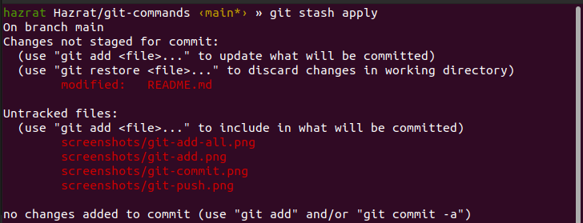
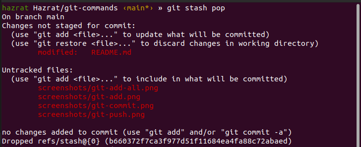
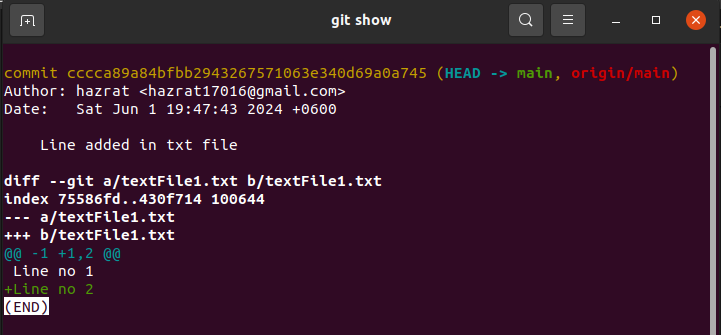
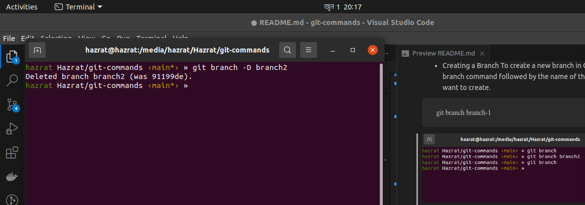

<h1 align="center"> Git Commands Scribe Sheet </h1>


<p align="center"><i>by <a href="https://github.com/Hazrat16">S.M. Hazrat Ali </a></i></p>

<p align="center">Here's a comprehensive scribe sheet for frequently used Git commands in professional settings, complete with descriptions, examples, and screenshots. </p>

### Table of Contents :

1. [Git Setup and Configuration](#git-setup-and-configuration)

   - [Git Setup](#git-setup)
   - [Git Version](#git-version)
   - [Git Config](#git-config)
   - [Git Alias](#git-alias)
   - [Git SSH Keys Setup](#git-ssh-keys-setup)

2. [Staging & Committing](#staging-&-committing)

   - [Git Init](#git-init)
   - [Git Clone](#git-clone)
   - [Git Status](#git-status)
   - [Git Add](#git-add)
   - [Git Commit](#git-commit)
   - [Git Stash](#git-stash)
   - [Git Restore](#git-restore)

3. [Inspection and Comparison](#inspection-and-comparison)

   - [Git Log](#git-log)
   - [Git Relog](#git-relog)
   - [Git Diff](#git-reset)
   - [Git Show](#git-show)

4. [Branching and Merging](#branching-and-merging)

   - [Git Branch](#git-branch)
   - [Git Checkout](#git-checkout)
   - [Git Merge](#git-merge)
   - [Git Rebase](#git-rebase)

5. [Collaboration](#collaboration)

   - [Git Remote](#git-remote)
   - [Git Push](#git-push)
   - [Git Fetch](#git-fetch)
   - [Git Pull](#git-pull)

6. [Git Undoing changes](#git-undoing-changes)

   - [Git Reset](#git-reset)
   - [Git Revert](#git-revert)
   - [Git Rm](#git-rm)
   - [Git Amend](#git-amend)
   - [Git Cherry Pick](#git-cherry-pick)

7. [Git Tagging](#git-tagging)
8. [Git Cleanup](#git-cleanup)
9. [Git Ignore Files](#git-ignore-files)
10. [Git Hooks](#git-hooks)
11. [Git Tips and Tricks](#git-tips-and-tricks)
12. [Git References](#git-references)

# Git Setup and Configuration :

## Git Setup:

Install Git on your system.

##### 1. Windows:

- Download Git from the [official Git website](https://git-scm.com/download/win).

##### 2. Linux:

**For Debian-based distributions (e.g., Ubuntu):**
Git is likely already installed in Linux distributions. You can confirm this is the case on your server with the following command:
`git --version`

1. Update the package list:

```bash
   sudo apt update
```

2. Install Git:

```bash
   sudo apt install git
```

##### 3. macOS:

Install Homebrew if you haven't already:

```bash
   /bin/bash -c "$(curl -fsSL https://raw.githubusercontent.com/Homebrew/install/HEAD/install.sh)"
```

## Git Version

Displays the currently installed version of Git.

- This command checks if Git is installed on your system. If Git is not installed, it will install it for you.
  **Example**

```bash
   git --version
```


**Description :**
Displays the current version of Git installed on your system. This command is useful for verifying that Git is installed and for checking the installed version to ensure compatibility with other tools or repositories.

## Git Config

Git config command is a convenience function that is used to set Git configuration values on a global or local project level
**Description :**
The git config command allows you to get and set configuration options that control the appearance and behavior of Git. Configurations can be set at three levels:

- System: Applies to every user on the system and all their repositories.
- Global: Applies to all repositories for the current user.
- Local: Applies to the specific repository you are currently working in


1. **Set User Name**
   Sets the name that will be attached to your commits and tags.
   **Example**

```bash
   // global config for name
   git config --global user.name "Hazrat"
```

2. **Set User Email**
   Sets the email address that will be attached to your commits and tags.

```bash
   // global config email
   git config --global user.name "hazrat@email.com"
```

## Git Alias

Git aliases are a powerful workflow tool that create shortcuts to frequently used Git commands.

**Example :**

```bash
   git config --global alias.co checkout
   git config --global alias.br branch
   git config --global alias.ci commit
   git config --global alias.st status
```

**Description :**

- Git alias is a mechanism for defining commands that are more accessible and easier to remember than the original command.
  These aliases make common Git commands shorter and easier to remember. For example:
  These aliases make common Git commands shorter and easier to remember. For example:

- `git co` instead of `git checkout`
- `git br` instead of `git branch`
- `git ci` instead of `git commit`
- `git st` instead of `git status`

---

## Git SSH Keys Setup

---

_This Section Optional for GitHub Users Who Want to setup SSH Keys_

Setting up SSH for GitHub involves generating a new SSH key, adding it to your SSH agent, and then adding the public key to your GitHub account

1. Generate a New SSH Key

**Example:**

```bash
   ssh-keygen -t rsa -b 4096 -C "gausalmunirtushar@gmail.com"

```

2. Add Your SSH Key to the SSH Agent

**Example:**

```bash
   eval "$(ssh-agent -s)"
   ssh-add ~/.ssh/id_rsa
```

3. Add the Public Key to Your GitHub Account

**Example:**

```bash
   cat ~/.ssh/id_rsa.pub
```

4. Test Your SSH Connection
   You can test your SSH connection to GitHub to ensure everything is set up correctly:

**Example:**

```bash
   ssh -T git@github.com
```

<!--  -->

**Description :**

- SSH keys allow you to securely authenticate Git commands to your repositories. These keys are used to authenticate Git commands when you push changes to your repositories.

[Back to Top](#git-setup)

# Staging & Committing

## Git Init

Initializes a new Git repository.
**Example**

```bash
   git init
```


**Description :**
Initializes a new Git repository. This command creates a new subdirectory named .git that contains all the necessary repository files.

## Git Status

To view the current status of the repository:
**Example**

```bash
   git status
```


- Git Status in Short

**Example**

```bash
   git status -s
```


**Description :**
When run git status, Git provides information about:

- Modified files: Files that have been changed but not yet staged for commit.
- Staged files: Changes that have been added to the staging area and are ready to be committed.
- Untracked files: Files that are not tracked by Git.

## Git Add

Adds file contents to the staging area.
**Example**

1. `git add file1.txt`: Adds changes in `file1.txt` to the staging area.

```bash
   git add file1.txt
```

2. `git add . `: Adds all changes in the current directory and its subdirectories to the staging area.

```bash
   git add .
```


3.`git add --all` : Adds all changes in the entire working tree to the staging area, including untracked files and removing files that have been deleted.

```bash
   git add --all
```


**Description :**
When you make changes to files in your working directory, Git doesn't automatically track those changes. You need to explicitly tell Git which changes you want to include in the next commit using git add.

## Git Commit

The `git commit` command is used to record changes to the repository.
**Example**

```bash
   git commit -m "commit message"
```


**Description :**

- The -m flag allows you to provide a commit message inline with the command.
- The commit message should be a brief description of the changes you are committing.
- After running git commit, Git creates a new commit with the changes staged in the index and records it permanently in the repository's history.

## Git Stash

The `git stash` command is used to temporarily store changes that are not ready to be committed. It allows you to switch branches or perform other operations without committing incomplete changes.

**Example**

```bash
   git stash
```


##### 2. git stash list

Lists all the stashed changes. Each stash is given an identifier, which you can use to apply or drop the stash later.

**Example :**

```bash
git stash list
```


##### 3. git stash apply

Applies the changes from a specific stash identified by stash_id. If no stash_id is provided, it applies the most recent stash.

**Example :**

```bash
   git stash apply
   git stash aplly stash@{2}
```



##### 4. git stash drop [stash_id]

Removes a specific stash identified by stash_id from the list of stashes. If no stash_id is provided, it drops the most recent stash.

**Example :**

```bash
   git stash drop [stash_id]
```


##### 5. git stash pop

Applies the changes from the most recent stash and removes it from the list of stashes.

**Example :**

```bash
   git stash pop
```



##### 6. git stash save

Saves the current state of the working directory and staging area, allowing you to apply or discard changes later.

**Example :**

```bash
   git stash save
```


##### 7. git stash show [stash_id]

Shows the contents of a specific stash identified by stash_id. If no stash_id is provided, it shows the most recent stash.

**Example :**

```bash
   git stash show [stash_id]
```


##### 8. git stash clear

Removes all stashes from the list of stashes.

**Example :**

```bash
   git stash clear
```


**Description :**

- `git stash` is a handy tool for managing work in progress without committing changes.
- It saves the current state of the working directory and staging area, allowing you to revert to it later.
- Stashed changes can be applied or discarded using git stash apply or git stash drop commands.
- git stash is useful for switching context quickly or temporarily setting aside unfinished work.

# Inspection and Comparison

## Git Log

The `git log` command is used to view the commit history of a repository. It displays a list of commits in reverse chronological order, showing the commit hash, author, date, and commit message.

**Example**

```bash
git log
```


**Description :**

- `git log` is a powerful tool for inspecting the history of a repository.
- It shows the commit history, including the commit hash (SHA-1 checksum), author name, email, date, and commit message.
- By default, git log displays the commits starting from the most recent.

## Git Show

The `git show` command is used to view the contents of a commit in the repository. It displays the commit hash, author, date, and commit message.

**Example**

```bash
   git show
```


**Description :**

- `git show` is a powerful command for viewing the contents of a commit in the repository.
- It displays the commit hash, author, date, and commit message.
- `git show` is useful for viewing the changes made in a particular commit.

[Back to Top](#git-setup)

# Branching and Merging

## Git Branch

The `git branch` command is used to list, create, or delete branches in a Git repository

**Example**

- To list all the local branches in the repository:

```bash
   git branch
```


- Creating a Branch
  To create a new branch in Git, you use the git branch command followed by the name of the new branch you want to create.

```bash
   git branch branch-1
```


- Deleting a Branch
  To delete a branch in Git, you use the `git branch -d` command followed by the name of the branch you want to delete.

```bash
   git branch -d branch-1
```



- Checking Out a Branch
  To switch to a different branch in Git, you use the `git checkout command` followed by the name of the branch you want to switch to.

```bash
   git checkout branchName
```


**Description :**

- When used without options, git branch lists all the local branches in the repository.
  The current branch is indicated with an asterisk (\*).
- Can create a new branch by providing a name after the git branch command.
- To delete a branch, use the -d option followed by the name of the branch you want to delete.

## Git Checkout

The `git checkout` command is used to switch branches in a Git repository. It allows you to view, create, or delete branches in a Git repository.
**Example**

```bash
   git checkout branch-1
```


**Description :**

- `git checkout`: This is the command to switch branches in a Git repository.
- `branch-1`: This is the name of the branch you want to switch to.

[Back to Top](#git-setup)

## Git Merge

The `git merge` command is used to merge changes from one branch into another branch in a Git repository.

**Example**

```bash
   git merge branch-1
```


**Description :**

- `git merge`: This is the command to merge changes from one branch into another branch in a Git repository.
- `branch-1`: This is the name of the branch you want to merge into the current branch.

### Git Rebase

The `git rebase` command is used to rebase the changes in the current branch onto the specified branch.

**Example**

```bash
   git rebase testbranch
```


**Description :**

- `git rebase` creates a new commit that reverts the changes introduced by the specified branch.
- It modifies the commit history and creates a new commit with the same changes as the last commit.
- `git rebase` is useful for creating a new commit with the same changes as the last commit without modifying the commit history.

[Back to Top](#git-setup)

# Collaboration

## Git Remote

The `git remote` command allows you to manage the remote repositories associated with your local repository. You can add, rename, remove, and view information about remotes.
**Example**

1. `git remote -v`: Lists all remote repositories along with their URLs.

```bash
   git remote --v
```


2. `git remote add <name of origin> <url> `: Adds a new remote repository.

```bash
   git remote add origin https://github.com/pathURL.git
```

3. `git remote remove <name> `: Removes the specified remote repository.

```bash
   git remote remove <name>
```

**Description :**

- The -v option stands for "verbose," and it displays both the URL of the remote repository and its nickname.
- When clone a repository, Git automatically creates a remote called origin that points to the original repository.
- add multiple remotes to your repository to collaborate with others or to manage different hosting services.

## Git Push

The `git push` command is used to upload local repository content to a remote repository.

**Example**
To push the commits from the local main branch to the main branch on the remote repository named origin:

```bash
   git push origin main
```


**Description :**

- `git push`: This is the command to push your local commits to a remote repository.
- `origin`: This is the default name Git gives to the server from which you cloned your repository. It represents the remote repository.
- `main`: This is the name of the branch you want to push your commits to on the remote repository.

### Git Fetch

The `git fetch` command is used to download the latest data from a remote repository without merging it with the data in your local repository.
**Example**

```bash
   git fetch origin
```


**Description :**

- `git fetch` retrieves the latest changes from the remote repository specified by its name (e.g., origin).
- It downloads new branches, tags, and commits from the remote repository without modifying your local branches.
- After fetching, you can inspect the changes using commands like git log or git diff.
- `git fetch` is useful for updating your local repository with changes from the remote repository without automatically merging them into your working branch.

## Git Pull

The `git pull` command is used to fetch and integrate changes from a remote repository into the current branch of your local repository.
**Example**

```bash
   git pull origin main
```


**Description :**

- git pull is a combination of two other Git commands: git fetch and git merge.
- It fetches changes from the specified remote repository and integrates them into the current branch.
- The <remote> argument specifies the remote repository from which - want to pull changes, and <branch> specifies the branch from which you want to pull changes.
- After fetching the changes, git pull automatically merges them into your current branch.

[Back to Top](#git-setup)

# Git Undoing changes

## Git Reset

The `git reset` command is used to reset the current HEAD to a specified state. It can be used to undo changes, unstage files, or move the HEAD to a different commit.

**Example**

```bash
   git reset HEAD~1
```


- git reset --hard moves the HEAD to the specified commit and discards all changes after that commit.

**Git Reset Soft and Hard**

- `git reset --soft` moves the HEAD to the specified commit, keeping the changes in the index.

```bash
   git reset --soft HEAD~1

```


- `git reset --hard` moves the HEAD to the specified commit and discards all changes after that commit.

```bash
   git reset --hard HEAD~1
```


**Description :**

- `git reset` is a versatile command with different options for resetting the repository state.
- With `git reset HEAD~1`, the HEAD moves back one commit, effectively undoing the last commit and keeping changes in the working directory.
- Depending on the options used (soft, mixed, or hard), git reset can reset the staging area, working directory, or both.

## Git Revert

The `git revert` command is used to undo changes made in previous commits. It creates a new commit that reverts the changes made in the specified commit.

**Example**

```bash
   git revert 345adgd
```

## Git Rm

The `git rm` command is used to remove files from the working directory and the staging area. It removes the specified files from the working directory and the staging area.

**Example**

```bash
   git rm textFile1.txt
```


**Description :**

- `git rm` removes files from the working directory and the staging area.
- It removes the specified files from the working directory and the staging area.
- `git rm` is useful for undoing changes made to files in the working directory or staging area.

[Back to Top](#git-setup)

**Description :**

- `git revert` creates a new commit that undoes the changes introduced by the specified commit.
- It does not modify the commit history but instead creates a new commit with the reversed changes.
- Multiple commits can be reverted in a single command by specifying their commit hashes.
- Reverting a merge commit requires specifying the parent commit to revert to.

## Git Amend

The `git amend` command is used to amend the last commit with the changes made in the current commit. It creates a new commit with the same changes as the last commit.

**Example**

```bash
   git amend
```

**Description :**

- `git amend` creates a new commit with the same changes as the last commit.
- It does not modify the commit history but instead creates a new commit with the same changes as the last commit.
- `git amend` is useful for creating a new commit with the same changes as the last commit without modifying the commit history.

## Git Cherry Pick

The `git cherry-pick` command is used to rebase the changes in the current branch onto the specified branch.

**Example**

```bash
   git cherry-pick <commitHashCode>
```

**Description :**

- `git cherry-pick` creates a new commit that reverts the changes introduced by the specified commit.
- It does not modify the commit history but instead creates a new commit with the reversed changes.
- Multiple commits can be cherry-picked in a single command by specifying their commit hashes.
- Cherry-picking a merge commit requires specifying the parent commit to cherry-pick from.


[Back to Top](#git-setup)

## Git Ignore Files

The `.gitignore` file tells Git which files (or patterns) it should ignore. This is useful for excluding temporary files, build artifacts, and other files that you do not want to commit to your repository.

1. Navigate to your Git repository's root directory.
2. Create a `.gitignore` file if it does not already exist:

```bash
   touch .gitignore
```

**Examples**

```bash
# Ignore node_modules directory
node_modules/

# Ignore log files
*.log

# Ignore OS-specific files
.DS_Store
Thumbs.db

# Ignore build outputs
/dist

# Ignore environment files
.env
```

##### Common .gitignore Patterns

- \*.log – Ignores all .log files.
- \*.tmp – Ignores all .tmp files.
- node_modules/ – Ignores the node_modules - directory.
- dist/ – Ignores the dist directory.
- .DS_Store – Ignores macOS specific file.
- Thumbs.db – Ignores Windows specific file.

**Description :**
By properly configuring your .gitignore file, you can ensure that unnecessary files are not included in your Git repository, keeping your project clean and organized.

[Back to Top](#git-setup)

## Git Hooks

- Soon to be release in this doc

## Git Tips and Tricks

- Soon to be release in this doc

## Git References

- [Git Official Documentation](https://git-scm.com/doc)
- [Git Cheat Sheet](https://www.git-scm.com/cheat-sheet/)
- [Git Guide Book](https://git-scm.com/book/en/v2)
- [Git Tutorial](https://www.tutorialspoint.com/git/index.htm)
- [Git Glossary](https://git-scm.com/docs/glossary)

[Back to Top](#git-setup)
